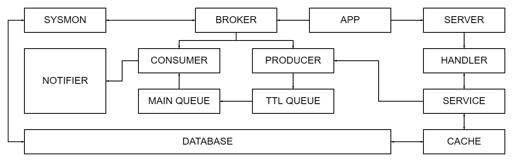

<h3 align="center">Production-grade delayed notification service using RabbitMQ message queues, Redis caching, and robust retry logic for guaranteed delivery.</h3>

## 


<br>

## Architecture

- **App** — the central orchestrator of the system.  
  Responsible for application bootstrap and lifecycle management. It loads configuration, initializes all core components (storage, cache, broker, service, sysmon), wires their dependencies together, and controls startup and graceful shutdown using a shared context.

- **Broker** — the messaging layer responsible for delayed delivery and message flow control.  
  It publishes notifications to per-notification delay queues in RabbitMQ, configured with TTL and dead-lettering into the main queue. The broker manages producers and consumers, monitors broker health, handles retries with backoff, and cooperates with recovery logic to ensure messages are not lost during outages.

- **Sysmon** — a background supervisor and maintenance loop.  
  Periodically performs database cleanup according to retention policies, monitors broker and database health, marks late notifications when delivery deadlines are missed, and triggers recovery when the broker transitions from an unhealthy to a healthy state.

- **Service** — the application-level business logic layer.  
  Validates incoming requests, enforces notification state transitions, coordinates interactions between cache, storage, and broker, and exposes a clean API to the HTTP layer. This is where domain rules live.

- **Cache** — auxiliary in-memory layer used to reduce database load (Redis).  
  Stores notification statuses and frequently accessed metadata to reduce database load and provide low-latency reads. Cache failures are non-fatal: the system transparently falls back to storage when needed.

- **Storage** — the persistent data layer and source of truth (PostgreSQL).  
  Stores notifications, recipients, statuses, and timestamps. Implements transactional updates, recovery queries and cleanup logic based on retention rules. All critical state transitions ultimately pass through storage.



<br>

## Installation
⚠️ Note: This project requires Docker Compose, regardless of how you choose to run it.  

First, clone the repository and enter the project folder:

```bash
git clone https://github.com/Pur1st2EpicONE/Chronos.git
cd Chronos
```

Then you have two options:

#### 1. Run everything in containers
```bash
make
```

This will start the entire project fully containerized using Docker Compose.

#### 2. Run Chronos locally
```bash
make local
```
In this mode, only PostgreSQL, RabbitMQ and Redis are started in containers via Docker Compose, while the application itself runs locally.

⚠️ Note:
Local mode requires Go 1.25.1 and the latest version of the migrate CLI tool installed on your machine.

<br>

## Configuration

### Runtime configuration

Chronos uses two configuration files, depending on the selected run mode:

[config.full.yaml](./configs/config.full.yaml) — used for the fully containerized setup

[config.dev.yaml](./configs/config.dev.yaml) — used for local development

You may optionally review and adjust the corresponding configuration file to match your preferences. The default values are suitable for most use cases.

### Environment variables and notification credentials

By default, Chronos runs without any external notification credentials. In this mode, delivery attempts to channels that require authentication (Telegram, Email) will fail, and notifications are effectively limited to stdout output. If you want to enable additional notification channels, you must provide the corresponding credentials via environment variables.

Chronos uses a .env file for runtime configuration. You may create your own .env file manually before running the service, or edit [.env.example](.env.example) and let it be copied automatically on startup.
If environment file does not exist, .env.example is copied to create it. If environment file already exists, it is used as-is and will not be overwritten.

⚠️ Note: Keep .env.example for local runs. Some Makefile commands rely on it and may break if it's missing.

<br>

## Shutting down

Stopping Chronos depends on how it was started:

- Local setup — press Ctrl+C to send SIGINT to the application. The service will gracefully close connections and finish any in-progress operations.  
- Full Docker setup — containers run by Docker Compose will be stopped automatically.

In both cases, to stop all services and clean up containers, run:

```bash
make down
```

⚠️ Note: In the full Docker setup, the log folder is created by the container as root and will not be removed automatically. To delete it manually, run:
```bash
sudo rm -rf <log-folder>
```